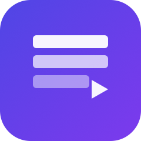
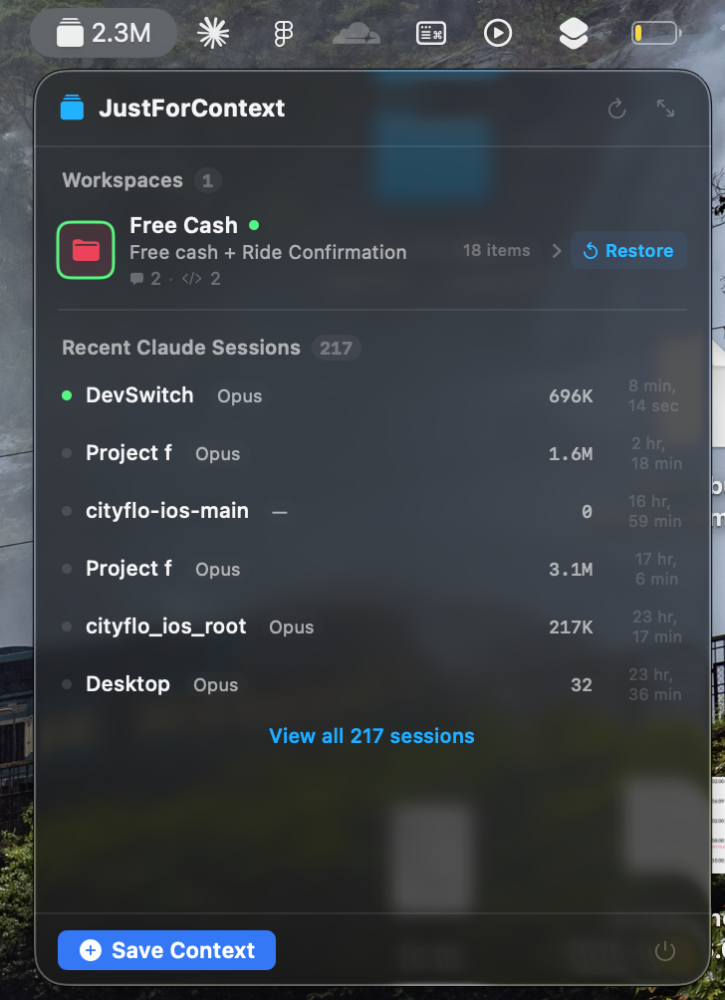
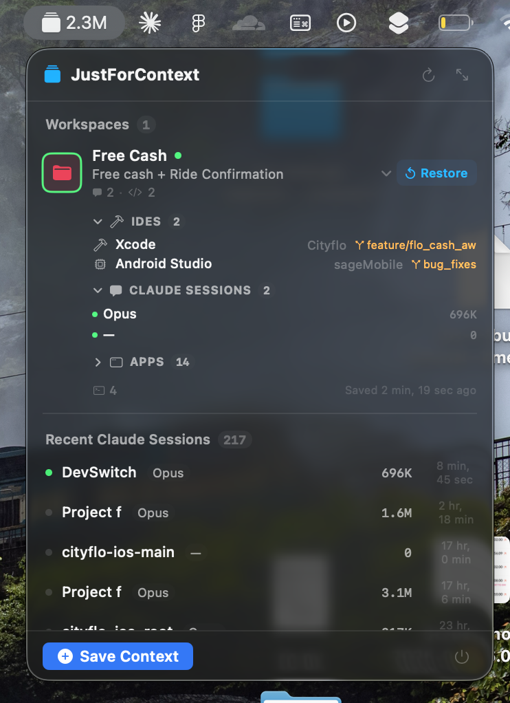
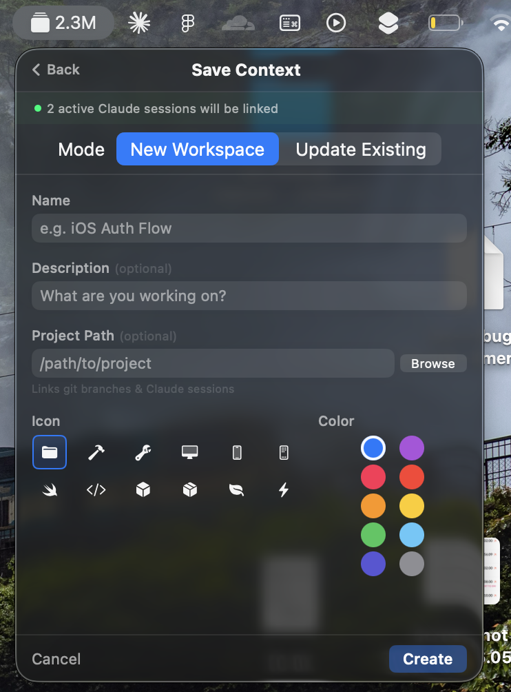
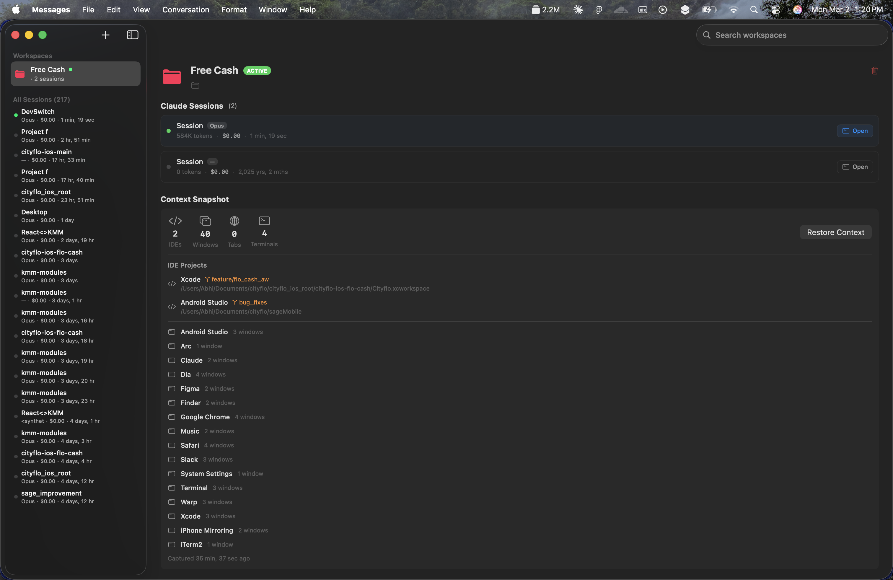

<h1 align="center">
  <br/>
  
  <br/>
  JustForContext
  <br/>
</h1>

<p align="center">
  <em>"Just for everyone's context..."</em> — every PM, every standup, every time.
</p>

<p align="center">
  
  
  
  
  <a href="https://buymeacoffee.com/noob_programmer"></a>
</p>

<p align="center">
  <a href="https://github.com/noob-programmer1/JustForContext/releases/latest"><b>Download DMG</b></a>
  &nbsp;·&nbsp;
  macOS 14+ &nbsp;·&nbsp; Apple Silicon & Intel
</p>

---

A native macOS menubar app that saves, switches, and restores your entire developer context — open IDEs, terminal sessions, browser tabs, window positions, git branches, and **Claude Code sessions** — in one click.

Think of it as `Cmd+Tab` for your brain. Stop losing 15 minutes re-opening everything when you switch between projects.

> **Warning**
> This project is in **early alpha** and very much a work in progress. Things may break, features may be incomplete, and there will be rough edges. Bug reports and contributions are welcome!

---

## Screenshots

| Popover | Expanded Workspace |
|:---:|:---:|
|  |  |
| Workspaces + recent Claude sessions | IDEs, Claude sessions, and captured apps |

| Save Context | Main Window |
|:---:|:---:|
|  |  |
| Inline workspace creation with session linking | Full workspace detail with context snapshot |

---

## Install

### Download (recommended)

1. Download the latest `.dmg` from the [Releases page](https://github.com/noob-programmer1/JustForContext/releases/latest)
2. Open the DMG and drag **JustForContext.app** into **Applications**
3. Launch from Applications

> **First launch:** The app is not notarized yet (no Apple Developer account). macOS will block it by default. To open:
> - Right-click the app → **Open** → **Open**
> - Or go to **System Settings → Privacy & Security** and click **Open Anyway**
> - You only need to do this once

### Permissions

On first launch, the app may request:
- **Accessibility** — capture and restore window positions
- **Automation** — detect open Xcode projects and browser tabs via AppleScript

---

## Features

### Workspace Context Capture
Save a complete snapshot of your current working state:
- **IDE projects** — Xcode, VS Code, Cursor, JetBrains IDEs with open project paths and git branches
- **Terminal sessions** — active tabs, working directories, and shell state
- **Browser tabs** — open URLs from Safari and Chrome
- **Window positions** — app windows and their screen locations
- **Git branch** — current branch auto-detected, checked out on restore

### Claude Code Session Linking
Automatically discovers and links [Claude Code](https://docs.anthropic.com/en/docs/claude-code) sessions to workspaces:
- **Live session discovery** — monitors `~/.claude/projects/` via FSEvents for real-time updates
- **Token tracking** — shows per-session and daily token usage in the menubar
- **One-click resume** — click any session to open Terminal and run `claude --resume`
- **Smart path resolution** — reads `cwd` from JSONL session files for reliable directory mapping

### Menubar Quick Access
Lives in your menubar, stays out of your way:
- **Token counter** — today's total Claude Code token usage at a glance
- **Expandable workspace rows** — click to see linked IDEs, sessions, and apps
- **Inline workspace creation** — save context without leaving the popover
- **Restore button** — one click to restore windows, check out branches, and reopen everything

### One-Click Context Switch
Switch between workspaces with full state restoration:
- Saves current workspace state before switching
- Checks out the target git branch
- Restores IDE projects, terminals, and window positions
- Re-links Claude Code sessions

### Smart Detection
- **Xcode detection** — AppleScript integration + `xcuserstate` file monitoring + DerivedData fallback
- **Self-exclusion** — automatically excludes itself from captured window lists via `Bundle.main.bundleIdentifier`
- **Branch detection** — auto-detects current git branch per workspace
- **Active session detection** — combines process monitoring + JSONL file modification timestamps

---

## Architecture

```
DevSwitch/
├── DevSwitchApp.swift           # @main — MenuBarExtra + Window scenes
├── Models/
│   ├── Workspace.swift          # Workspace with git branch, linked sessions
│   ├── WorkspaceSnapshot.swift  # Point-in-time capture of IDE/window/terminal state
│   ├── LinkedClaudeSession.swift # Claude Code session with cwd, tokens, cost
│   ├── IDEState.swift           # Detected IDE project state
│   └── SessionRecord.swift      # JSONL record types (Codable)
├── Data/
│   ├── JSONLParser.swift        # Parse Claude Code JSONL session files
│   ├── FSEventsWatcher.swift    # CoreServices file system monitoring
│   ├── FileOffsetTracker.swift  # Incremental file reading (byte offsets)
│   └── HomeDirectory.swift      # Home directory resolution
├── Services/
│   ├── ClaudeSessionService.swift  # Session discovery + workspace matching
│   ├── ContextSwitcher.swift       # Orchestrates save/switch/restore
│   ├── IDEService.swift            # Xcode/VS Code/JetBrains detection
│   ├── WindowCaptureService.swift  # CGWindowListCopyWindowInfo capture
│   ├── BrowserService.swift        # Safari/Chrome tab capture via AppleScript
│   ├── TerminalService.swift       # Terminal.app/iTerm2 session capture
│   ├── GitService.swift            # Git branch operations
│   ├── SessionLauncher.swift       # Opens claude --resume in Terminal
│   └── WorkspaceStore.swift        # JSON persistence for workspaces
├── ViewModels/
│   └── WorkspaceListViewModel.swift # Main state for popover + sidebar
└── Views/
    ├── MenuBar/
    │   ├── PopoverView.swift        # Menubar popover with workspaces + sessions
    │   └── MenuBarLabel.swift       # Icon + token count in menubar
    ├── Main/
    │   ├── MainWindow.swift         # Full window with sidebar
    │   ├── WorkspaceDetailView.swift
    │   └── ClaudeSessionRow.swift
    └── Shared/
        ├── ColorHex.swift
        ├── SaveContextSheet.swift
        └── WorkspaceRow.swift
```

**Tech stack:** SwiftUI + AppKit · Swift 6 strict concurrency · `@Observable` · FSEvents · AppleScript · No external dependencies

---

## Build from Source

### Requirements
- macOS 14.0 (Sonoma) or later
- Xcode 16.0 or later
- [XcodeGen](https://github.com/yonaskolb/XcodeGen) (optional, for regenerating the project)

### Steps

```bash
# Clone the repo
git clone https://github.com/noob-programmer1/JustForContext.git
cd JustForContext

# Open in Xcode
open DevSwitch.xcodeproj

# Or build from command line
xcodebuild -project DevSwitch.xcodeproj -scheme DevSwitch -destination 'platform=macOS' build
```

If you modify `project.yml` or add/remove source files:
```bash
brew install xcodegen
xcodegen generate
```

---

## Contributing

Contributions are welcome! This project is in early alpha — there's plenty to improve.

### Getting Started

1. Fork the repo
2. Create a feature branch: `git checkout -b feature/my-feature`
3. Make your changes
4. Test by building and running: `Cmd+R` in Xcode
5. Commit your changes: `git commit -m "Add my feature"`
6. Push to your fork: `git push origin feature/my-feature`
7. Open a Pull Request

### Areas for Contribution

- **More IDE support** — Add detection for Sublime Text, Nova, Zed, Neovim
- **More terminal support** — Better iTerm2/Warp/Kitty integration
- **Keyboard shortcuts** — Global hotkeys for workspace switching
- **Import/export** — Share workspace configs between machines
- **Menu bar customization** — Choose what to display (tokens, cost, active sessions)
- **Bug fixes** — Path edge cases, detection reliability, UI polish

### Code Style

- Swift 6 with strict concurrency
- `@Observable` (not `ObservableObject`)
- No external dependencies unless absolutely necessary
- Keep views small and composable

---

## Roadmap

- [ ] Global keyboard shortcuts for switching
- [ ] Workspace groups/tags
- [ ] Menu bar display customization
- [ ] Launch at login
- [ ] Export/import workspace configs
- [ ] iTerm2 and Warp native integration
- [ ] Session cost tracking and budgets
- [ ] Notification alerts (high token burn rate)

---

## Support

If this saves you from the "wait, what was I working on?" spiral, consider buying me a coffee.

<a href="https://buymeacoffee.com/noob_programmer">
  
</a>

---

## License

MIT License — see [LICENSE](LICENSE) for details.

---

<p align="center">
  <sub>Built because <code>Cmd+Tab</code> doesn't remember what you were thinking.</sub>
</p>
